# Actividad14
Aplicación móvil en Xamarin de un sistema de renta de estacionamientos con Web API en .NET Core

## Imágenes ## 
Android | iOS | UWP
:-----------------------:|:----------------:|:-----------------:
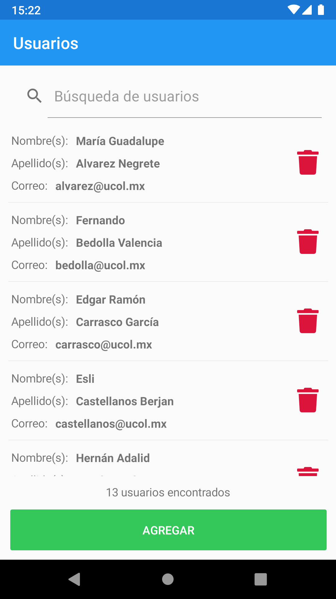 | 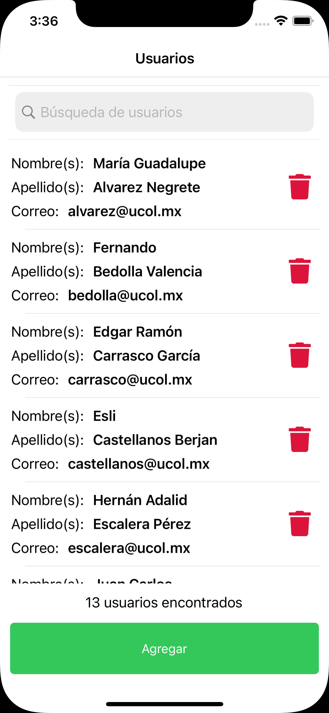 | 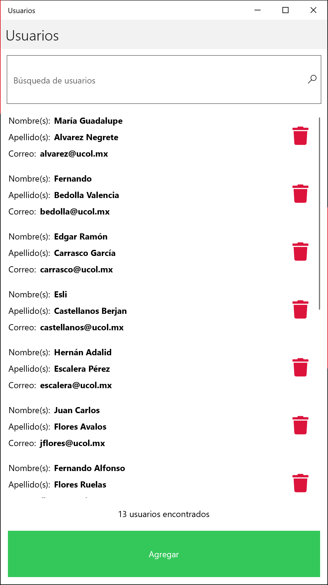
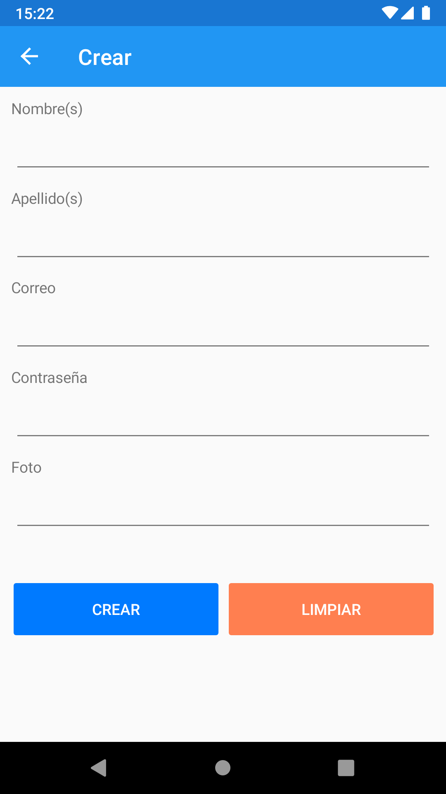 | 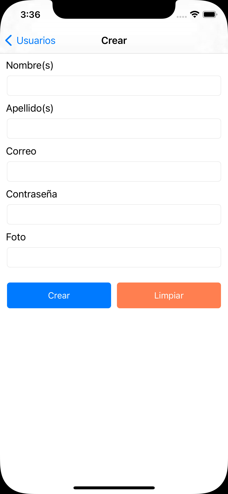 | 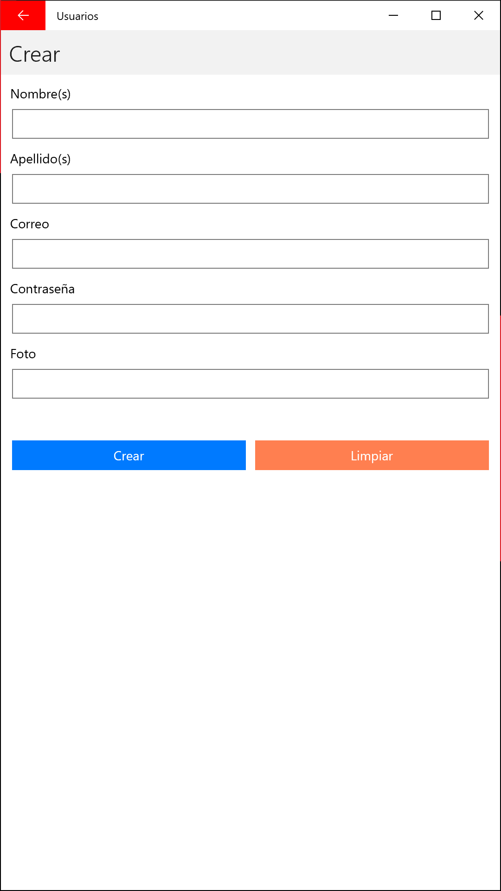
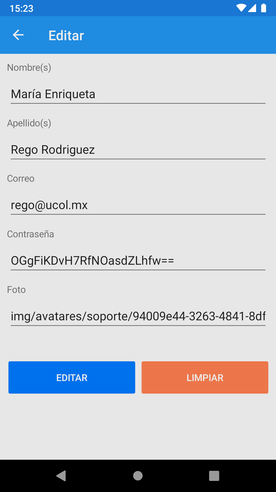 | 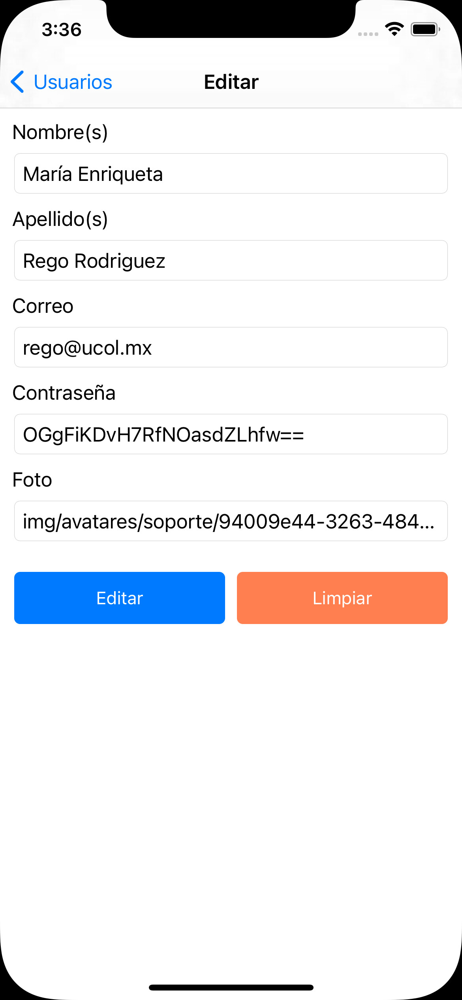 | 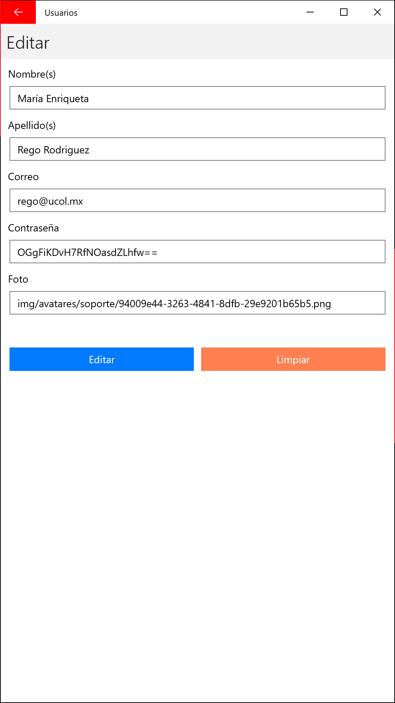
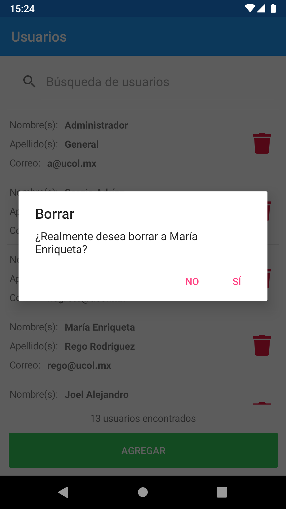 | 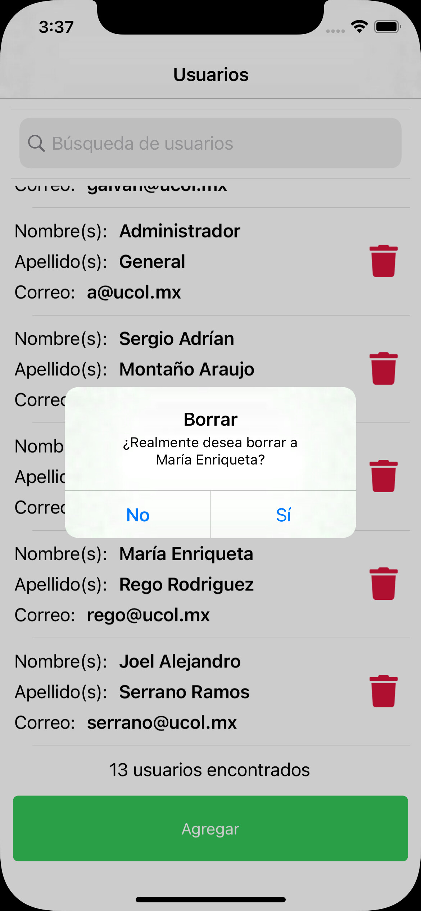 | 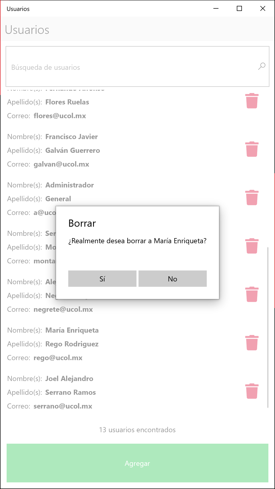
 | 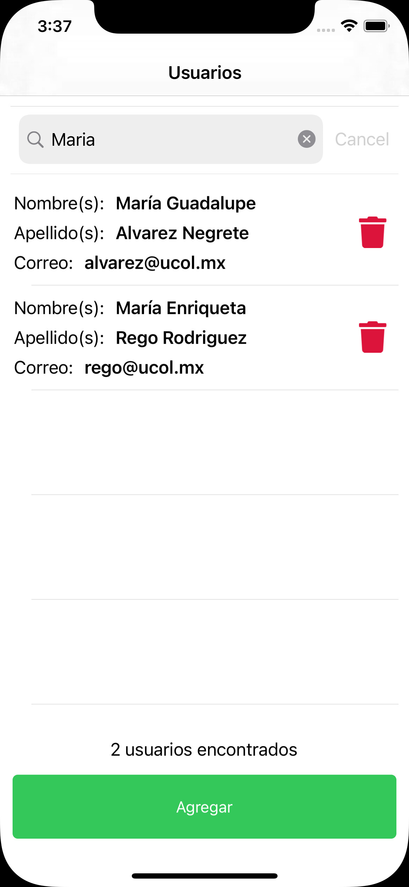 | 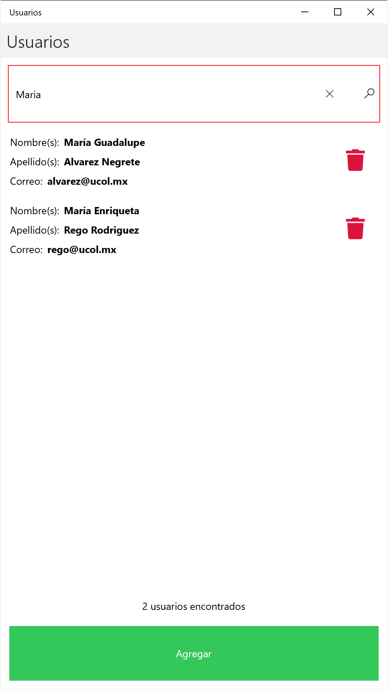

API | API | API
:-----------------------:|:----------------:|:-----------------:
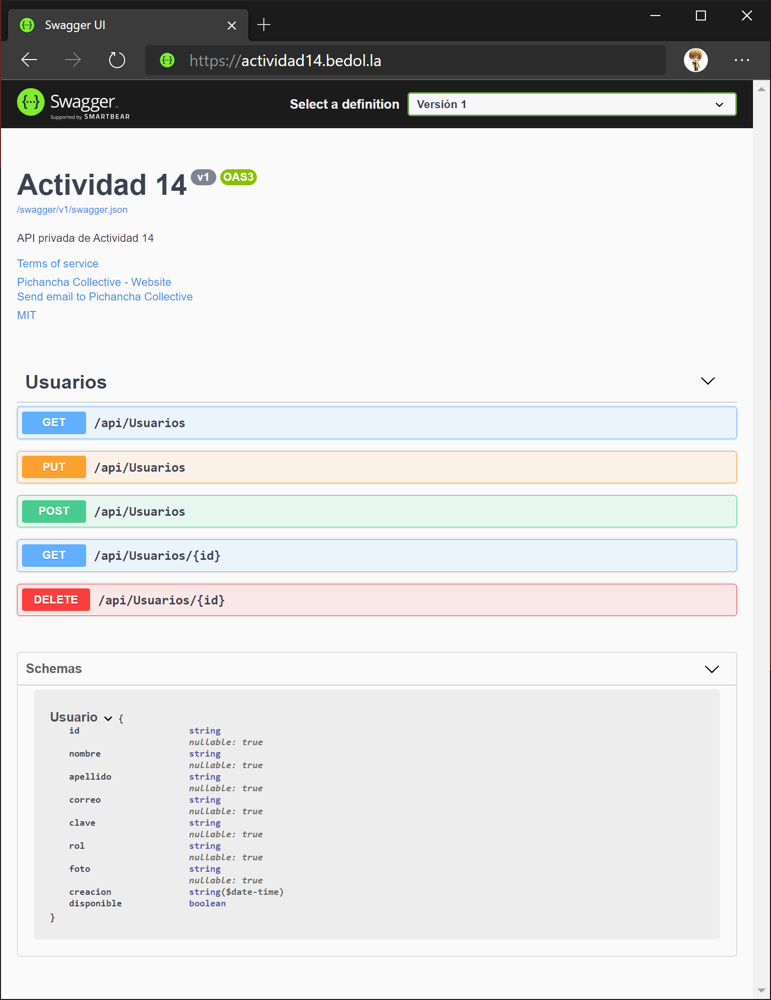 | 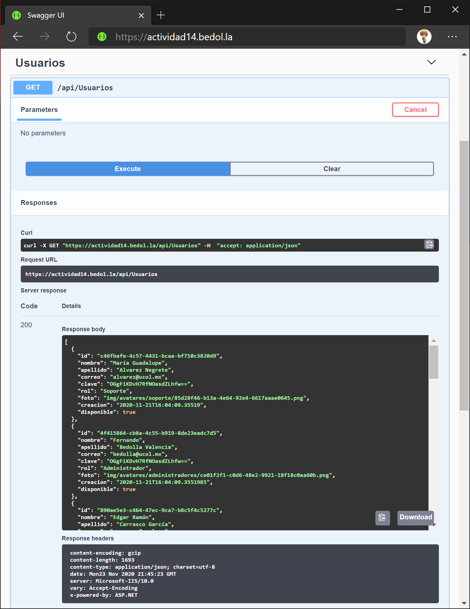 | 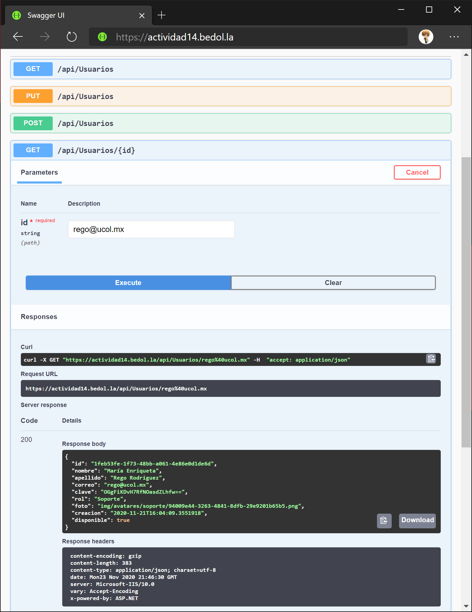

## Equipo ##

* María Guadalupe Alvarez Negrete
* María Enriqueta Rego Rodriguez
* Fernando Bedolla Valencia
